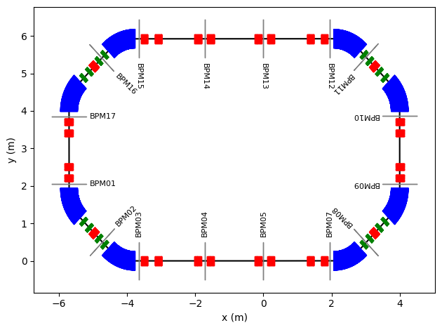
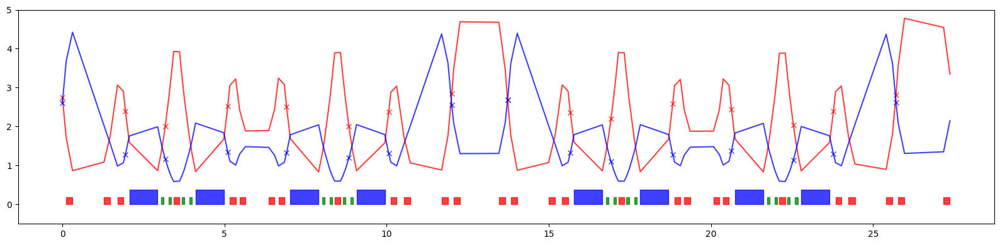
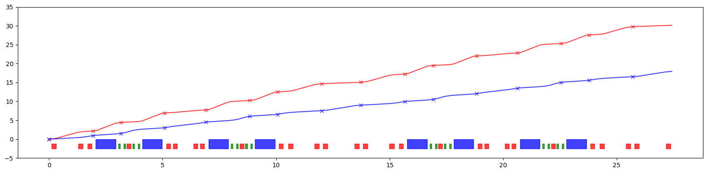
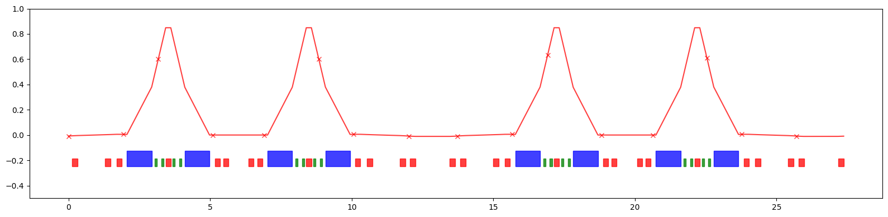
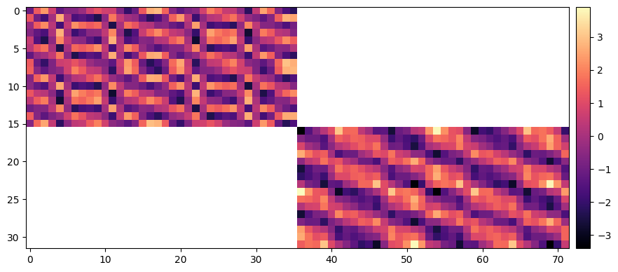

# model, 2024

<p align="center">
  
</p>

[](https://doi.org/10.5281/zenodo.13933324)

Simple accelerator lattice model with composable derivatives in PyTorch. 
Computation of parametric closed orbit, Twiss parameters and other observables.

# Install

```
$ pip install git+https://github.com/i-a-morozov/model.git@main
```

# Documentation and examples

[](https://colab.research.google.com/github/i-a-morozov/model/blob/main/docs/source/examples/model.ipynb)

[https://i-a-morozov.github.io/model/](https://i-a-morozov.github.io/model/)

# Demo


```python
# In this DEMO basic functionality used for linear lattice analysis is demonstrated
```


```python
# Set data type and device

import torch

dtype = torch.float64
device = torch.device('cuda') if torch.cuda.is_available() else torch.device('cpu')
```


```python
# Use selected data type and device for all elements

from model.library.element import Element

Element.dtype = dtype
Element.device = device
```


```python
# Load ELEGANT SDDS twiss or other table

from pathlib import Path
from model.command.external import load_sdds

path = Path('ic.twiss')

# parameters -- {parameter: value}
# columns    -- {element: {parameter: value}}

parameters, columns = load_sdds(path)
```


```python
# Set tunes, twiss parameters, phase advances and dispersion at BPMs

from model.command.util import select

NUX = torch.tensor(parameters['nux'] % 1, dtype=torch.float64)
NUY = torch.tensor(parameters['nuy'] % 1, dtype=torch.float64)

kinds = select(columns, 'ElementType')

S = torch.tensor([value for value, kind in zip(select(columns, 's').values(), kinds.values()) if kind == 'MONI'], dtype=dtype, device=device)

AX = torch.tensor([value for value, kind in zip(select(columns, 'alphax').values(), kinds.values()) if kind == 'MONI'], dtype=dtype, device=device)
BX = torch.tensor([value for value, kind in zip(select(columns, 'betax' ).values(), kinds.values()) if kind == 'MONI'], dtype=dtype, device=device)
AY = torch.tensor([value for value, kind in zip(select(columns, 'alphay').values(), kinds.values()) if kind == 'MONI'], dtype=dtype, device=device)
BY = torch.tensor([value for value, kind in zip(select(columns, 'betay' ).values(), kinds.values()) if kind == 'MONI'], dtype=dtype, device=device)

MUX = torch.tensor([value for value, kind in zip(select(columns, 'psix').values(), kinds.values()) if kind == 'MONI'], dtype=dtype, device=device)
MUY = torch.tensor([value for value, kind in zip(select(columns, 'psiy').values(), kinds.values()) if kind == 'MONI'], dtype=dtype, device=device)

DQX = torch.tensor([value for value, kind in zip(select(columns, 'etax' ).values(), kinds.values()) if kind == 'MONI'], dtype=dtype, device=device)
DPX = torch.tensor([value for value, kind in zip(select(columns, 'etaxp').values(), kinds.values()) if kind == 'MONI'], dtype=dtype, device=device)
DQY = torch.tensor([value for value, kind in zip(select(columns, 'etay' ).values(), kinds.values()) if kind == 'MONI'], dtype=dtype, device=device)
DPY = torch.tensor([value for value, kind in zip(select(columns, 'etayp').values(), kinds.values()) if kind == 'MONI'], dtype=dtype, device=device)
```


```python
# Load and build ELEGANT lattice

from model.command.external import load_lattice

path = Path('ic.lte')
data = load_lattice(path)

from model.library.line import Line
from model.command.build import build

ring:Line = build('RING', 'ELEGANT', data)

# Flatten lattice

ring.flatten()

# Merge adjacent drifts (all drifts are renamed)

ring.merge()

# Set linear flag in dipoles (dipoles are nonlinear by default)

for element in ring:
    if element.kind == 'Dipole':
        element.linear = True

# Set number of elements of different kinds

nb = ring.describe['BPM']
nd = ring.describe['Dipole']
nq = ring.describe['Quadrupole']
ns = ring.describe['Sextupole']

# Describe

print(ring.describe)
```

    {'BPM': 16, 'Drift': 68, 'Quadrupole': 28, 'Dipole': 8, 'Sextupole': 16}


```python
# Plot 2D layout

from model.command.layout import Layout

line = ring.clone()
line.ns = 0.01
layout = Layout(line)

# Generate reference orbit

x, y, _ = layout.orbit(flat=False, step=0.01, start=(0, 0))

# Generate layout

blocks, _ = layout.profile_2d(start=(0, 0), delta=1.0, linewidth=1.0, exclude=['Drift'])
_, labels = layout.profile_2d(start=(0, 0), delta=1.0, linewidth=1.0, exclude=['Dipole', 'Quadrupole', 'Sextupole', 'Drift'], fontsize=8)

# Plot

from matplotlib import pyplot as plt

plt.figure()
plt.plot(x, y, color='black')
for block in blocks:
    plt.errorbar(**block)
for label in labels:
    plt.text(**label)
plt.xlabel(r'x (m)')
plt.ylabel(r'y (m)')
plt.tight_layout()
plt.show()
```





```python
# Tracking (single initial)

x = torch.tensor([0.001, 0.0, 0.0, 0.0], dtype=dtype, device=device)

print(ring(x))
```

    tensor([-0.0045,  0.0091,  0.0000,  0.0000], dtype=torch.float64)


```python
# Tracking (vectorized map over initial values)

xs = torch.tensor(2**10*[4*[0.0]], dtype=dtype, device=device)

print(torch.vmap(ring)(xs).shape)
```

    torch.Size([1024, 4])


```python
# Tracking (pass deviation parameters)

data = ring.data()
data['Q3D3']['kn'] = 0.25

print(ring(x, data=data))
```

    tensor([-0.0044,  0.0089,  0.0000,  0.0000], dtype=torch.float64)


```python
# Tracking (wrapper)

from model.command.wrapper import group

kn = torch.tensor([0.25], dtype=dtype, device=device)
mapping, *_ = group(ring, 0, len(ring) - 1, ('kn', None, ['Q3D3'], None))

print(mapping(x, kn))
```

    tensor([-0.0044,  0.0089,  0.0000,  0.0000], dtype=torch.float64)


```python
# Differentiability with respect to initial state

print(torch.func.jacrev(mapping, 0)(x, kn))
print(torch.func.jacrev(mapping, 1)(x, kn))
```

    tensor([[-4.4739, -2.6532,  0.0000,  0.0000],
            [ 8.9295,  5.0721,  0.0000,  0.0000],
            [ 0.0000,  0.0000,  3.8653, -2.1508],
            [ 0.0000,  0.0000,  5.5530, -2.8312]], dtype=torch.float64)
    tensor([[ 0.0004],
            [-0.0007],
            [ 0.0000],
            [ 0.0000]], dtype=torch.float64)


```python
# Differentiability with respect to deviation parameters

print(torch.func.jacrev(mapping, 1)(x, kn))
```

    tensor([[ 0.0004],
            [-0.0007],
            [ 0.0000],
            [ 0.0000]], dtype=torch.float64)


```python
# Tunes

from model.command.tune import tune

nux, nuy = tune(ring, [], matched=True)

print(torch.allclose(NUX, nux, rtol=1.0E-12, atol=1.0E-12))
print(torch.allclose(NUY, nuy, rtol=1.0E-12, atol=1.0E-12))
```

    True
    True


```python
# Parametric tunes

def fn(dp, kn, ks):
    return tune(ring, [dp, kn, ks], ('dp', None, None, None), ('kn', ['Quadrupole'], None, None),  ('ks', ['Quadrupole'], None, None), matched=True)

# Vectorizing map

dp = torch.tensor([0.0], dtype=dtype, device=device)

kn = torch.zeros(nq, dtype=dtype, device=device)
ks = torch.zeros(nq, dtype=dtype, device=device)

print(torch.vmap(fn, in_dims=(None, 0, None))(dp, torch.stack(2**10*[kn]), ks).shape)

# Derivatives

print(torch.func.jacrev(fn, 0)(dp, kn, ks))
print(torch.func.jacrev(fn, 1)(dp, kn, ks))
```

    torch.Size([1024, 2])
    tensor([[0.0284],
            [0.7658]], dtype=torch.float64)
    tensor([[ 0.0187,  0.0217,  0.0461,  0.0601,  0.0484,  0.0297,  0.0299,  0.0488,
              0.0597,  0.0457,  0.0214,  0.0192,  0.0669,  0.0667,  0.0191,  0.0216,
              0.0461,  0.0597,  0.0483,  0.0296,  0.0297,  0.0485,  0.0595,  0.0459,
              0.0209,  0.0196,  0.0683,  0.0647],
            [-0.0668, -0.0283, -0.0136, -0.0078, -0.0141, -0.0205, -0.0202, -0.0137,
             -0.0079, -0.0137, -0.0282, -0.0661, -0.0250, -0.0251, -0.0663, -0.0282,
             -0.0137, -0.0079, -0.0138, -0.0203, -0.0205, -0.0140, -0.0078, -0.0137,
             -0.0288, -0.0659, -0.0250, -0.0258]], dtype=torch.float64)


```python
# Twiss parameters

from model.command.twiss import twiss

ax, bx, ay, by = twiss(ring, [], alignment=False, matched=True, advance=True, full=False).T
```


```python
# Compare Twiss parameters at BPMs

ax_bpm, bx_bpm, ay_bpm, by_bpm = torch.stack([torch.stack([*cs]) for (_, kind, *_), *cs in zip(ring.layout(), ax, bx, ay, by) if kind == 'BPM']).T

print(torch.allclose(AX, ax_bpm, rtol=1.0E-12, atol=1.0E-12))
print(torch.allclose(BX, bx_bpm, rtol=1.0E-12, atol=1.0E-12))
print(torch.allclose(AY, ay_bpm, rtol=1.0E-12, atol=1.0E-12))
print(torch.allclose(BY, by_bpm, rtol=1.0E-12, atol=1.0E-12))
```

    True
    True
    True
    True


```python
# Plot beta functions

from matplotlib.patches import Rectangle

layout = Layout(ring)
_, _, lengths, *_ = layout.slicing_table()
rectangles = layout.profile_1d(scale=0.75, shift=0.0, text=False,  exclude=['BPM', 'Drift'])

plt.figure(figsize=(16, 4))
plt.errorbar(S.cpu().numpy(), BX.cpu().numpy(), fmt=' ', color='red', alpha=0.75, marker='x')
plt.errorbar(ring.locations().cpu().numpy(), bx.cpu().numpy(), fmt='-', color='red', alpha=0.75)
plt.errorbar(S.cpu().numpy(), BY.cpu().numpy(), fmt=' ', color='blue', alpha=0.75, marker='x')
plt.errorbar(ring.locations().cpu().numpy(), by.cpu().numpy(), fmt='-', color='blue', alpha=0.75)
for rectangle in rectangles:
    plt.gca().add_patch(Rectangle(**rectangle))
plt.ylim(-0.5, 5.0)
plt.tight_layout()
plt.show()
```





```python
# Parametric twiss (lattice start location)

def fn(dp, kn, ks):
    return twiss(ring, [dp, kn, ks], ('dp', None, None, None), ('kn', ['Quadrupole'], None, None),  ('ks', ['Quadrupole'], None, None), advance=False, matched=True)

# Vectorizing map

dp = torch.tensor([0.0], dtype=dtype, device=device)

kn = torch.zeros(nq, dtype=dtype, device=device)
ks = torch.zeros(nq, dtype=dtype, device=device)

print(torch.vmap(fn, in_dims=(None, 0, None))(dp, torch.stack(2**10*[kn]), ks).shape)

# Derivatives

print(torch.func.jacrev(fn, 0)(dp, kn, ks))
print(torch.func.jacrev(fn, 1)(dp, kn, ks))
```

    torch.Size([1024, 4])
    tensor([[-222.0538],
            [-110.7909],
            [  27.9708],
            [ -13.9537]], dtype=torch.float64)
    tensor([[-0.0893,  0.4014,  1.2554, -0.9068, -1.5491, -0.9866, -0.6147, -0.7071,
             -1.9186,  0.2045, -0.1659,  0.4221,  1.9239,  2.2147,  0.5854, -0.4487,
             -0.4684, -1.9595, -0.0112, -0.2204, -0.9209, -1.5967, -0.0541,  1.5081,
              0.5988, -0.3222, -0.4638,  0.8415],
            [ 0.0182,  0.1496,  0.5733, -0.6730, -0.7756, -0.5178, -0.4104, -0.5325,
             -0.9651,  0.2699, -0.0145,  0.1734,  0.9035,  1.1954,  0.3374, -0.2984,
             -0.4055, -1.0062,  0.1660, -0.0147, -0.4518, -0.8235,  0.1829,  0.8281,
              0.3562, -0.2319, -0.4848,  0.2358],
            [ 1.6183, -0.0219, -0.2993, -0.0049,  0.3526,  0.2005, -0.5750, -0.4693,
              0.1832,  0.0065, -0.5948, -2.2667, -0.8472,  0.8119,  2.2819,  0.7206,
              0.0759, -0.2127,  0.4684,  0.6358, -0.0792, -0.2893, -0.0394,  0.3584,
              0.2001, -1.2685, -0.6598,  0.2486],
            [-0.7202,  0.1496,  0.2258, -0.0342, -0.1608, -0.0228,  0.3921,  0.2789,
             -0.1348,  0.0622,  0.4565,  1.3632,  0.4758, -0.5180, -1.3618, -0.3315,
              0.0206,  0.1024, -0.2828, -0.3332,  0.1447,  0.2237, -0.0135, -0.1681,
              0.0184,  1.0088,  0.4647, -0.2653]], dtype=torch.float64)


```python
# Phase advance

from model.command.advance import advance

mux, muy =  advance(ring, [], alignment=False, matched=True).T
```


```python
# Total tunes

print(torch.allclose(mux.sum()/(2*torch.pi), torch.tensor(parameters['nux'], dtype=torch.float64), rtol=1.0E-12, atol=1.0E-12))
print(torch.allclose(muy.sum()/(2*torch.pi), torch.tensor(parameters['nuy'], dtype=torch.float64), rtol=1.0E-12, atol=1.0E-12))
```

    True
    True


```python
# Plot accumulated phase advance

mux_sum = torch.cat([torch.tensor([0.0], dtype=torch.float64), mux.cumsum(-1)])
muy_sum = torch.cat([torch.tensor([0.0], dtype=torch.float64), muy.cumsum(-1)])

layout = Layout(ring)
_, _, lengths, *_ = layout.slicing_table()
rectangles = layout.profile_1d(scale=5.0, shift=-2.5, text=False,  exclude=['BPM', 'Drift'])

plt.figure(figsize=(16, 4))
plt.errorbar(S.cpu().numpy(), MUX.cpu().numpy(), fmt=' ', color='red', alpha=0.75, marker='x')
plt.errorbar(torch.cat([ring.locations(), ring.length.unsqueeze(-1)]).cpu().numpy(), mux_sum.cpu().numpy(), fmt='-', color='red', alpha=0.75)
plt.errorbar(S.cpu().numpy(), MUY.cpu().numpy(), fmt=' ', color='blue', alpha=0.75, marker='x')
plt.errorbar(torch.cat([ring.locations(), ring.length.unsqueeze(-1)]).cpu().numpy(), muy_sum.cpu().numpy(), fmt='-', color='blue', alpha=0.75)
for rectangle in rectangles:
    plt.gca().add_patch(Rectangle(**rectangle))
plt.ylim(-5.0, 35.0)
plt.tight_layout()
plt.show()
```





```python
# Parametric advance

def fn(dp, kn, ks):
    return advance(ring, [dp, kn, ks], ('dp', None, None, None), ('kn', ['Quadrupole'], None, None),  ('ks', ['Quadrupole'], None, None), matched=True)

# Vectorizing map

dp = torch.tensor([0.0], dtype=dtype, device=device)

kn = torch.zeros(nq, dtype=dtype, device=device)
ks = torch.zeros(nq, dtype=dtype, device=device)

print(torch.vmap(fn, in_dims=(None, 0, None))(dp, torch.stack(2**10*[kn]), ks).shape)

# Derivatives

print(torch.func.jacrev(fn, 0)(dp, kn, ks).shape)
print(torch.func.jacrev(fn, 1)(dp, kn, ks).shape)
```

    torch.Size([1024, 136, 2])
    torch.Size([136, 2, 1])
    torch.Size([136, 2, 28])


```python
# Dispersion

from model.command.orbit import dispersion

guess = torch.tensor(4*[0.0], dtype=dtype, device=device)
dqx, dpx, dqy, dpy = dispersion(ring, guess, [], advance=True, full=False)
```


```python
# Compare dispersion at BPMs

dqx_bpm, dpx_bpm, dqy_bpm, dpy_bpm = torch.stack([torch.stack([*cs]) for (_, kind, *_), *cs in zip(ring.layout(), dqx, dpx, dqy, dpy) if kind == 'BPM']).T

print(torch.allclose(DQX, dqx_bpm, rtol=1.0E-12, atol=1.0E-12))
print(torch.allclose(DPX, dpx_bpm, rtol=1.0E-12, atol=1.0E-12))
print(torch.allclose(DQY, dqy_bpm, rtol=1.0E-12, atol=1.0E-12))
print(torch.allclose(DPY, dpy_bpm, rtol=1.0E-12, atol=1.0E-12))
```

    True
    True
    True
    True


```python
# Plot dispersion

layout = Layout(ring)
_, _, lengths, *_ = layout.slicing_table()
rectangles = layout.profile_1d(scale=0.25, shift=-0.25, text=False,  exclude=['BPM', 'Drift'])

plt.figure(figsize=(16, 4))
plt.errorbar(S.cpu().numpy(), DQX.cpu().numpy(), fmt=' ', color='red', alpha=0.75, marker='x')
plt.errorbar(ring.locations().cpu().numpy(), dqx.cpu().numpy(), fmt='-', color='red', alpha=0.75)
for rectangle in rectangles:
    plt.gca().add_patch(Rectangle(**rectangle))
plt.ylim(-0.5, 1.0)
plt.tight_layout()
plt.show()
```





```python
# Parametric dispersion

def fn(kn, ks):
    return dispersion(ring, guess, [kn, ks], ('kn', ['Quadrupole'], None, None),  ('ks', ['Quadrupole'], None, None), advance=False)

# Vectorizing map

kn = torch.zeros(nq, dtype=dtype, device=device)
ks = torch.zeros(nq, dtype=dtype, device=device)

print(torch.vmap(fn, in_dims=(0, None))(torch.stack(2**10*[kn]), ks).shape)

# Derivatives

print(torch.func.jacrev(fn, 0)(kn, ks))
print(torch.func.jacrev(fn, 1)(kn, ks))
```

    torch.Size([1024, 4])
    tensor([[-1.1162e-03, -8.2786e-04, -2.4801e-03,  1.9629e-01,  2.7563e-05,
              9.5180e-06, -2.3718e-05, -4.7673e-05, -1.0284e-01,  2.2051e-03,
              6.9025e-04,  1.3755e-03,  5.3769e-03,  5.7391e-03,  1.5789e-03,
              3.3797e-04,  1.3670e-03,  8.2397e-02, -6.1463e-05, -3.5245e-05,
             -1.4306e-05, -1.4063e-05,  3.4270e-01, -2.6831e-03, -9.3952e-04,
             -6.7697e-04, -3.2418e-03, -4.2953e-03],
            [ 1.6338e-03,  1.6955e-03,  4.8680e-03, -5.0176e-01, -9.1579e-06,
              8.7653e-06,  6.6251e-05,  1.2097e-04,  2.7302e-02, -3.4149e-03,
             -9.8856e-04, -2.7727e-03, -1.0457e-02, -1.0501e-02, -2.7973e-03,
             -9.4603e-04, -3.3137e-03,  1.1249e-02,  9.2654e-05,  5.0532e-05,
              8.0420e-06, -3.5286e-06, -5.1448e-01,  4.8677e-03,  1.6412e-03,
              1.7617e-03,  7.6393e-03,  9.0321e-03],
            [ 0.0000e+00,  0.0000e+00,  0.0000e+00,  0.0000e+00,  0.0000e+00,
              0.0000e+00,  0.0000e+00,  0.0000e+00,  0.0000e+00,  0.0000e+00,
              0.0000e+00,  0.0000e+00,  0.0000e+00,  0.0000e+00,  0.0000e+00,
              0.0000e+00,  0.0000e+00,  0.0000e+00,  0.0000e+00,  0.0000e+00,
              0.0000e+00,  0.0000e+00,  0.0000e+00,  0.0000e+00,  0.0000e+00,
              0.0000e+00,  0.0000e+00,  0.0000e+00],
            [ 0.0000e+00,  0.0000e+00,  0.0000e+00,  0.0000e+00,  0.0000e+00,
              0.0000e+00,  0.0000e+00,  0.0000e+00,  0.0000e+00,  0.0000e+00,
              0.0000e+00,  0.0000e+00,  0.0000e+00,  0.0000e+00,  0.0000e+00,
              0.0000e+00,  0.0000e+00,  0.0000e+00,  0.0000e+00,  0.0000e+00,
              0.0000e+00,  0.0000e+00,  0.0000e+00,  0.0000e+00,  0.0000e+00,
              0.0000e+00,  0.0000e+00,  0.0000e+00]], dtype=torch.float64)
    tensor([[ 0.0000e+00,  0.0000e+00,  0.0000e+00,  0.0000e+00,  0.0000e+00,
              0.0000e+00,  0.0000e+00,  0.0000e+00,  0.0000e+00,  0.0000e+00,
              0.0000e+00,  0.0000e+00,  0.0000e+00,  0.0000e+00,  0.0000e+00,
              0.0000e+00,  0.0000e+00,  0.0000e+00,  0.0000e+00,  0.0000e+00,
              0.0000e+00,  0.0000e+00,  0.0000e+00,  0.0000e+00,  0.0000e+00,
              0.0000e+00,  0.0000e+00,  0.0000e+00],
            [ 0.0000e+00,  0.0000e+00,  0.0000e+00,  0.0000e+00,  0.0000e+00,
              0.0000e+00,  0.0000e+00,  0.0000e+00,  0.0000e+00,  0.0000e+00,
              0.0000e+00,  0.0000e+00,  0.0000e+00,  0.0000e+00,  0.0000e+00,
              0.0000e+00,  0.0000e+00,  0.0000e+00,  0.0000e+00,  0.0000e+00,
              0.0000e+00,  0.0000e+00,  0.0000e+00,  0.0000e+00,  0.0000e+00,
              0.0000e+00,  0.0000e+00,  0.0000e+00],
            [ 6.0868e-03, -1.9121e-03, -1.6954e-03,  2.1783e-01,  1.3196e-04,
              1.1426e-04,  4.9850e-05,  1.7995e-05, -3.0953e-01, -2.5745e-03,
             -1.3526e-03,  1.0628e-03,  1.8173e-04, -7.3803e-03, -6.3713e-03,
              2.3662e-03,  2.6927e-03, -7.3148e-02, -9.2005e-05, -9.1568e-05,
             -6.9841e-05, -5.2553e-05,  1.9908e-01,  3.1329e-03,  2.0529e-03,
             -3.7047e-03, -3.4655e-03,  5.5212e-03],
            [ 3.3306e-03, -9.0348e-04, -6.1116e-04,  1.6731e-01,  7.2547e-05,
              5.7852e-05,  1.3325e-05, -6.7422e-06, -2.0683e-01, -1.2303e-03,
             -5.0343e-04, -2.6321e-04, -9.7110e-04, -4.6478e-03, -3.8785e-03,
              1.3020e-03,  1.3295e-03, -9.1948e-02, -5.6294e-05, -5.2568e-05,
             -3.2302e-05, -1.9640e-05,  1.5820e-01,  1.7351e-03,  1.0243e-03,
             -1.4231e-03, -1.0576e-03,  3.9832e-03]], dtype=torch.float64)


```python
# Modify lattice for ORM computation

from model.library.corrector import Corrector

# Clone lattice

copy = ring.clone()

# Split BPMs and change lattice start

copy.split((None, ['BPM'], None, None))
copy.roll(1)

# Insert correctors into quadrupoles and dipoles

ncq = 2**2
ncd = 2**4

for name in [name for name, kind, *_ in copy.layout() if kind == 'Quadrupole']:
    corrector = Corrector(f'{name}_CXY', factor=1/(ncq - 1))
    copy.split((ncq, None, [name], None), paste=[corrector])

for name in [name for name, kind, *_ in copy.layout() if kind == 'Dipole']:
    corrector = Corrector(f'{name}_CXY', factor=1/(ncd - 1))
    copy.split((ncd, None, [name], None), paste=[corrector])

# Splice lattice

copy.splice()

# Print sequence between first two BPMs

line, *_ = copy
print(line)
```

    BPM(name="BPM05", direction="inverse", dp=0.0)
    Drift(name="DR001", length=0.116715, dp=0.0, exact=False, ns=1, order=0)
    Quadrupole(name="Q3D3", length=0.0491425, kn=-8.426928737999999, ks=0.0, dp=0.0, exact=False, ns=1, order=0)
    Corrector(name="Q3D3_CXY", cx=0.0, cy=0.0, factor=0.3333333333333333, dp=0.0)
    Quadrupole(name="Q3D3", length=0.0491425, kn=-8.426928737999999, ks=0.0, dp=0.0, exact=False, ns=1, order=0)
    Corrector(name="Q3D3_CXY", cx=0.0, cy=0.0, factor=0.3333333333333333, dp=0.0)
    Quadrupole(name="Q3D3", length=0.0491425, kn=-8.426928737999999, ks=0.0, dp=0.0, exact=False, ns=1, order=0)
    Corrector(name="Q3D3_CXY", cx=0.0, cy=0.0, factor=0.3333333333333333, dp=0.0)
    Quadrupole(name="Q3D3", length=0.0491425, kn=-8.426928737999999, ks=0.0, dp=0.0, exact=False, ns=1, order=0)
    Drift(name="DR002", length=0.9684299999999999, dp=0.0, exact=False, ns=1, order=0)
    Quadrupole(name="Q3D2", length=0.0491425, kn=-2.695188250999999, ks=0.0, dp=0.0, exact=False, ns=1, order=0)
    Corrector(name="Q3D2_CXY", cx=0.0, cy=0.0, factor=0.3333333333333333, dp=0.0)
    Quadrupole(name="Q3D2", length=0.0491425, kn=-2.695188250999999, ks=0.0, dp=0.0, exact=False, ns=1, order=0)
    Corrector(name="Q3D2_CXY", cx=0.0, cy=0.0, factor=0.3333333333333333, dp=0.0)
    Quadrupole(name="Q3D2", length=0.0491425, kn=-2.695188250999999, ks=0.0, dp=0.0, exact=False, ns=1, order=0)
    Corrector(name="Q3D2_CXY", cx=0.0, cy=0.0, factor=0.3333333333333333, dp=0.0)
    Quadrupole(name="Q3D2", length=0.0491425, kn=-2.695188250999999, ks=0.0, dp=0.0, exact=False, ns=1, order=0)
    Drift(name="DR003", length=0.221715, dp=0.0, exact=False, ns=1, order=0)
    Quadrupole(name="Q3F2", length=0.045, kn=13.544085930000001, ks=0.0, dp=0.0, exact=False, ns=1, order=0)
    Corrector(name="Q3F2_CXY", cx=0.0, cy=0.0, factor=0.3333333333333333, dp=0.0)
    Quadrupole(name="Q3F2", length=0.045, kn=13.544085930000001, ks=0.0, dp=0.0, exact=False, ns=1, order=0)
    Corrector(name="Q3F2_CXY", cx=0.0, cy=0.0, factor=0.3333333333333333, dp=0.0)
    Quadrupole(name="Q3F2", length=0.045, kn=13.544085930000001, ks=0.0, dp=0.0, exact=False, ns=1, order=0)
    Corrector(name="Q3F2_CXY", cx=0.0, cy=0.0, factor=0.3333333333333333, dp=0.0)
    Quadrupole(name="Q3F2", length=0.045, kn=13.544085930000001, ks=0.0, dp=0.0, exact=False, ns=1, order=0)
    Drift(name="DR004", length=0.065, dp=0.0, exact=False, ns=1, order=0)
    BPM(name="BPM07", direction="forward", dp=0.0)


```python
# Compute and plot ORM

from model.command.orbit import ORM

orm = ORM(copy, guess, [])
print(orm.shape)

data = orm.clone()
data[data==0.0] = torch.nan

plt.figure(figsize=(10, 10))
img = plt.imshow(data.cpu().numpy(), cmap='magma', interpolation='nearest')
cax = plt.gcf().add_axes([plt.gca().get_position().x1 + 0.01, plt.gca().get_position().y0, 0.02, plt.gca().get_position().height])
plt.colorbar(img, cax=cax)
plt.show()
```

    torch.Size([32, 72])





```python
# Parametric ORM

def fn(dp, kn, ks):
    return ORM(copy, guess, [dp, kn, ks], ('dp', None, None, None), ('kn', ['Quadrupole'], None, None),  ('ks', ['Quadrupole'], None, None))

dp = torch.tensor([0.0], dtype=dtype, device=device)
kn = torch.zeros(nq, dtype=dtype, device=device)
ks = torch.zeros(nq, dtype=dtype, device=device)

print(torch.func.jacrev(fn, 0)(dp, kn, ks).shape)
print(torch.func.jacrev(fn, 1)(dp, kn, ks).shape)
```

    torch.Size([32, 72, 1])
    torch.Size([32, 72, 28])


# Related projects

[https://i-a-morozov.github.io/twiss/](https://i-a-morozov.github.io/twiss/)

[https://i-a-morozov.github.io/ndmap/](https://i-a-morozov.github.io/ndmap/)
